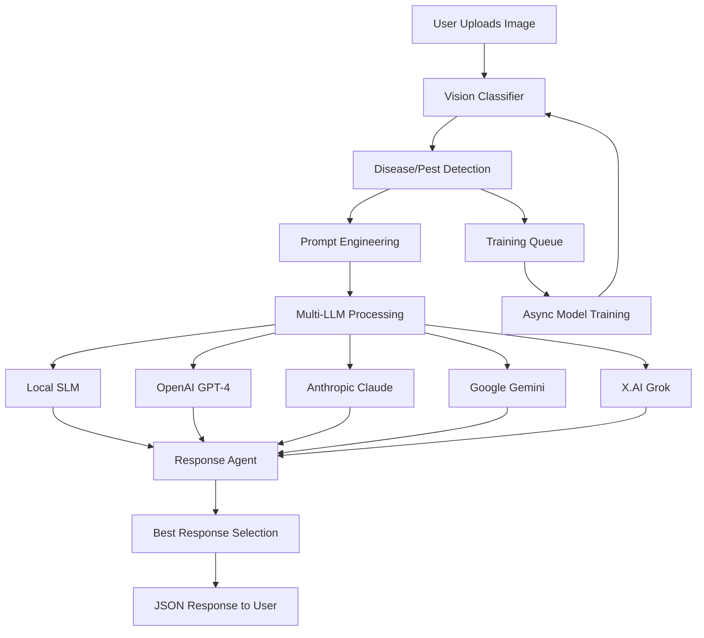

# 🌾 Agricultural AI System - Complete Documentation

## Overview

This is a comprehensive agricultural AI system that combines computer vision, large language models (LLMs), and intelligent decision-making to provide expert plant disease and pest management recommendations. The system uses multiple AI models in parallel with cross-validation to ensure accurate and reliable advice for farmers and agricultural professionals.

## 🏗️ System Architecture

```
┌─────────────────────────────────────────────────────────────────────────────────┐
│                           Agricultural AI Pipeline                              │
└─────────────────────────────────────────────────────────────────────────────────┘
                                        │
                              ┌─────────▼─────────┐
                              │  FastAPI Server   │
                              │  (Port 8000)      │
                              └─────────┬─────────┘
                                        │
                    ┌───────────────────┼───────────────────┐
                    │                   │                   │
            ┌───────▼────────┐ ┌────────▼────────┐ ┌───────▼────────┐
            │  Vision Model  │ │   LLM Manager   │ │ Response Agent │
            │ (EfficientNet) │ │ (Multi-Provider)│ │ (Decision AI)  │
            └────────────────┘ └─────────────────┘ └────────────────┘
                    │                   │                   │
        ┌───────────▼──────────────────▼───────────────────▼───────────┐
        │                   Data Flow                                  │
        │  Image → Classification → Prompt → Multi-LLM → Selection     │
        └─────────────────────────────────────────────────────────────┘
```

## 🧠 Core Components

### 1. Vision Classifier (`PlantClassifier`)
- **Location**: `app/models/vision_classifier.py`
- **Model**: EfficientNet-B0 (Pre-trained, Fine-tuned)
- **Purpose**: Identifies plant diseases and pests from images
- **Features**:
  - Dynamic class management
  - Asynchronous retraining
  - GPU acceleration (CUDA)
  - Model versioning and checkpoints
  - Confidence scoring with top-3 predictions

#### Vision Model Pipeline:
```python
Image Upload → Preprocessing → EfficientNet → Classification → Confidence Scoring
```

#### Model Training Flow:
```
User Feedback → Training Queue → Stratified Sampling → 
Model Update → Validation → Checkpoint Saving → Model Reload
```

### 2. Multi-LLM Manager (`MultiLLMManager`)
- **Location**: `app/models/llm_manager.py`
- **Supported Providers**:
  - **Local SLM**: `bharatgenai/AgriParam` (Hugging Face model)
  - **OpenAI**: GPT-4/GPT-4o
  - **Anthropic**: Claude-3.5-Sonnet
  - **Google**: Gemini-1.5-Pro
  - **Grok**: X.AI's Grok-Beta

#### LLM Processing Flow:
```
Prompt → Parallel API Calls → Response Aggregation → Cross-Validation
```

### 3. Response Agent (`ResponseAgent`)
- **Location**: `app/models/response_agent.py`
- **Purpose**: Intelligent selection of best LLM response
- **Scoring Criteria**:
  - Clarity and readability
  - Technical accuracy confidence
  - Relevance to agricultural context
  - Response completeness
  - Provider reliability scores

## 📊 Data Flow Architecture

### Primary Analysis Pipeline:



### Cross-Validation Process:

```python
# Agent Decision Logic
for provider, response in llm_responses:
    score = calculate_score(
        clarity=assess_readability(response),
        confidence=response.confidence,
        relevance=agricultural_context_match(response),
        completeness=check_response_completeness(response)
    )
    
selected_response = max(scores, key=lambda x: x.score)
```

## 🗂️ Directory Structure

```
backend(agri main)/
├── app/
│   ├── __init__.py
│   ├── main.py                    # FastAPI application entry point
│   │
│   ├── core/
│   │   ├── config.py             # Settings and configuration
│   │   ├── dependencies.py       # Dependency injection
│   │   ├── security.py           # Authentication & authorization
│   │   └── logging_config.py     # Logging setup
│   │
│   ├── models/
│   │   ├── vision_classifier.py  # Plant disease/pest CNN model
│   │   ├── llm_manager.py        # Multi-LLM orchestration
│   │   ├── response_agent.py     # Response selection AI
│   │   ├── llm.py               # Core LLM interfaces
│   │   └── model_manager.py     # Model lifecycle management
│   │
│   ├── routers/
│   │   ├── ai_pipeline.py        # Main AI endpoints
│   │   ├── analyze.py           # Analysis endpoints
│   │   ├── weather.py           # Weather integration
│   │   └── feedback.py          # User feedback handling
│   │
│   ├── services/
│   │   ├── image_service.py      # Image processing & storage
│   │   ├── llm_service.py        # LLM communication
│   │   └── weather_service.py    # Weather data integration
│   │
│   ├── schemas/
│   │   ├── base_models.py        # Pydantic models
│   │   ├── llm_schemas.py        # LLM request/response schemas
│   │   └── mongo_schema.py       # MongoDB document schemas
│   │
│   └── database/
│       ├── mongodb_schema.py     # MongoDB collections
│       └── postgre_schema.py     # PostgreSQL tables
│
├── data/
│   ├── models/                   # Trained model files
│   │   ├── weights/             # Model weights
│   │   ├── disease_labels.json  # Class labels
│   │   └── model_metadata.json  # Model information
│   │
│   ├── uploads/                 # User uploaded images
│   ├── cache/                   # Response caching
│   ├── analysis_cache/          # Analysis result cache
│   └── weather_cache/           # Weather data cache
│
├── scripts/
│   ├── train.py                 # Model training scripts
│   ├── dataset_preparation.py   # Data preprocessing
│   └── bulk_ingest.py          # Bulk data processing
│
└── notebooks/
    └── agricultural_ai_training.ipynb  # Training notebooks
```

## 🔧 API Endpoints

### Core Analysis Endpoints

#### 1. Plant Image Analysis
```http
POST /ai/analyze-plant
Content-Type: multipart/form-data

Parameters:
- image: File (required) - Plant image
- label: string (optional) - User-provided label
- user_provided_label: boolean - Whether label is user-provided
- enable_training: boolean - Enable model training
- llm_providers: string - LLM providers to use ("all", "local", "external")
- chain_mode: boolean - Enable LLM chaining
- debug: boolean - Include debug information

Response:
{
  "status": "success",
  "timestamp": "2025-09-26T18:30:41.933913",
  "processing_time_seconds": 12.45,
  "classification": {
    "predicted_class": "tomato_late_blight",
    "confidence": 0.89,
    "top_predictions": [...]
  },
  "llm_responses": {
    "local_slm": {...},
    "openai": {...},
    "google": {...}
  },
  "agent_decision": {
    "selected_provider": "openai",
    "selected_response": "Treatment recommendations...",
    "confidence": 0.92,
    "reasoning": "Selected openai (score: 0.89); excellent technical accuracy"
  }
}
```

#### 2. Direct LLM Query
```http
POST /ai/ask
Content-Type: application/json

{
  "prompt": "What are best practices for crop irrigation?",
  "providers": "all",  // "all", "local", "external", or comma-separated list
  "max_tokens": 400
}

Response:
{
  "llm_responses": {
    "local_slm": {...},
    "google": {...}
  },
  "agent_decision": {
    "selected_provider": "local_slm",
    "selected_response": "Crop irrigation should be...",
    "confidence": 0.64
  },
  "timestamp": "2025-09-26T18:30:41.933913"
}
```

#### 3. System Status
```http
GET /ai/llm/status

Response:
{
  "enabled_providers": ["local_slm", "google"],
  "local": {
    "loaded": true,
    "model_name": "bharatgenai/AgriParam",
    "device": "cuda:0",
    "gpu_memory": {
      "allocated_mb": 5512,
      "total_mb": 4095
    }
  },
  "api_keys_present": {
    "openai": false,
    "anthropic": false,
    "grok": false,
    "google": true
  }
}
```

### Model Management Endpoints

#### 4. Model Information
```http
GET /ai/model-info

Response:
{
  "vision_model": {
    "model_path": "/path/to/model",
    "num_classes": 50,
    "class_names": [...],
    "current_version": 3
  },
  "llm_providers": {
    "enabled": ["local_slm", "google"],
    "local_slm": {
      "loaded": true,
      "device": "cuda:0"
    }
  }
}
```

## 🤖 Model Training & Saving Flow

### Vision Model Training Pipeline

```python
# Training Flow
class PlantClassifier:
    async def add_training_sample(self, image, label, user_provided=False):
        """Add sample to training queue"""
        # 1. Generate unique sample ID
        # 2. Save image to training_data/
        # 3. Add to training queue
        # 4. Trigger training if queue >= threshold
        
    def _train_model(self):
        """Background training process"""
        # 1. Stratified train/validation split
        # 2. Class weight computation (inverse frequency)
        # 3. Bias correction (log-prior initialization)
        # 4. Mini-batch training with early stopping
        # 5. Best model checkpoint saving
        # 6. Training history logging
```

### Training Configuration

```python
# Configurable training parameters
training_config = {
    "min_samples_per_class": 2,      # Minimum samples for class weighting
    "learning_rate": 7e-4,           # Base learning rate
    "batch_size": 8,                 # Training batch size
    "epochs": 3,                     # Maximum epochs
    "early_stopping_patience": 2,    # Early stopping patience
    "validation_split": 0.15,        # Validation set fraction
    "weighted_loss": True,           # Enable class weighting
    "bias_correction": True,         # Enable bias correction
    "save_best_only": True          # Save only best epoch
}
```

### Model Versioning System

```
app/models(ml)/vision/
├── plant_classifier_v1.pt        # Version 1
├── plant_classifier_v2.pt        # Version 2
├── plant_classifier_v3.pt        # Latest version
├── class_names.json              # Class labels
├── training_config.json          # Training parameters
├── slm_versions/                 # SLM checkpoints
│   ├── agriparam_v1/
│   └── agriparam_v2/
└── logs/
    └── training_history.json     # Training logs
```

### Secure Model Loading

```python
def load_latest_model(self):
    """Load model with security measures"""
    try:
        # Prefer weights_only=True to prevent pickle attacks
        checkpoint = torch.load(
            model_path, 
            map_location=self.device, 
            weights_only=True
        )
    except (TypeError, Exception):
        # Fallback for older PyTorch or metadata loading
        checkpoint = torch.load(model_path, map_location=self.device)
```

## ⚙️ Configuration Management

### Environment Variables (.env)

```bash
# Database Configuration
DB_USER=postgres
DB_PASSWORD=root
DB_HOST=localhost
DB_PORT=5432
DB_NAME=agri

# MongoDB Configuration
MONGODB_HOST=localhost
MONGODB_PORT=27017
MONGODB_NAME=agri

# LLM API Keys
OPENAI_API_KEY=your_openai_key
ANTHROPIC_API_KEY=your_anthropic_key
GEMINI_API_KEY=your_gemini_key
GROK_API_KEY=your_grok_key

# Hugging Face Token (for local models)
HF_API_TOKEN=your_huggingface_token
```

### Model Configuration

```python
# app/core/config.py
class Settings(BaseSettings):
    # LLM Configuration
    SLM_LOCAL_ENABLED: bool = True
    SLM_MODEL_NAME: str = "bharatgenai/AgriParam"
    SLM_MAX_NEW_TOKENS: int = 300
    SLM_TEMPERATURE: float = 0.6
    
    # Cross-validation settings
    ENABLE_CROSS_VALIDATION: bool = True
    CROSS_VALIDATION_THRESHOLD: float = 0.7
    CONSENSUS_WEIGHT_SLM: float = 0.3
    CONSENSUS_WEIGHT_LLM: float = 0.7
    
    # Vision Model settings
    CONFIDENCE_THRESHOLD: float = 0.5
    MODEL_TEMPERATURE: float = 0.2
```

## 🚀 Deployment & Usage

### Installation

```bash
# 1. Clone repository
git clone <repository-url>
cd backend(agri\ main)

# 2. Setup environment
conda create -n agriculture python=3.11
conda activate agriculture

# 3. Install dependencies
pip install -r requirements.txt

# 4. Configure environment
cp .env.example .env
# Edit .env with your API keys and database settings

# 5. Initialize databases
# Setup PostgreSQL and MongoDB

# 6. Start server
uvicorn app.main:app --reload --host 0.0.0.0 --port 8000
```

### CUDA Setup (for GPU acceleration)

```bash
# Install CUDA-enabled PyTorch
pip uninstall torch torchvision torchaudio
pip install --index-url https://download.pytorch.org/whl/cu121 \
    torch==2.5.0 torchvision==0.20.0 torchaudio==2.5.0

# Verify CUDA installation
python -c "import torch; print(torch.cuda.is_available())"
```

### Usage Examples

```python
# Python client example
import requests

# Upload image for analysis
with open('plant_image.jpg', 'rb') as f:
    response = requests.post(
        'http://localhost:8000/ai/analyze-plant',
        files={'image': f},
        data={
            'llm_providers': 'all',
            'enable_training': True
        }
    )

result = response.json()
print(f"Detected: {result['classification']['predicted_class']}")
print(f"Recommendation: {result['agent_decision']['selected_response']}")
```

```bash
# CLI usage with curl
curl -X POST "http://localhost:8000/ai/ask" \
  -H "Content-Type: application/json" \
  -d '{
    "prompt": "How to treat tomato blight?",
    "providers": "all"
  }'
```

## 📈 Performance & Monitoring

### System Metrics
- **Vision Model**: ~2-5 seconds per image (GPU)
- **Local SLM**: ~10-30 seconds per query (GPU)
- **External LLMs**: ~2-10 seconds per query (API)
- **Memory Usage**: ~5.5GB GPU for local models

### Monitoring Endpoints
- `/ai/llm/status` - LLM provider status
- `/ai/model-info` - Model information
- Health checks via FastAPI built-in `/docs`

### Caching Strategy
- Image analysis results cached by trace_id
- LLM responses cached for similar queries
- Model metadata cached in memory

## 🔒 Security Features

### Data Protection
- EXIF metadata removal from uploaded images
- Secure model loading with `weights_only=True`
- API key validation and rotation support
- Input sanitization and validation

### Privacy
- Temporary image storage with cleanup
- No persistent storage of user queries (optional)
- Configurable data retention policies

## 🛠️ Development & Extension

### Adding New LLM Providers

```python
# 1. Add API configuration
"new_provider": {
    "url": "https://api.newprovider.com/v1/chat",
    "model": "new-model",
    "headers": {"Authorization": f"Bearer {os.getenv('NEW_API_KEY')}"}
}

# 2. Implement API call method
async def call_new_provider(self, prompt: str) -> LLMResponse:
    # Implementation here
    pass

# 3. Add to enabled providers check
if os.getenv('NEW_API_KEY'):
    providers.append("new_provider")

# 4. Add to parallel execution
if "new_provider" in self.enabled_providers:
    tasks.append(("new_provider", self.external_llm.call_new_provider(prompt)))
```

### Custom Vision Models

```python
def create_model(self) -> nn.Module:
    """Customize the vision architecture"""
    model = models.efficientnet_b0(weights='DEFAULT')
    # Add custom layers, attention mechanisms, etc.
    model.classifier = nn.Sequential(
        nn.Dropout(0.3),
        nn.Linear(model.classifier[1].in_features, self.num_classes),
        # Add custom layers here
    )
    return model
```

## 📚 Additional Resources

### Training Data Management
- **Location**: `app/models(ml)/training_data/`
- **Format**: Images with metadata JSON files
- **Augmentation**: Built-in transforms for training robustness

### Logging & Debugging
- **Training History**: `data/logs/training_history.json`
- **API Logs**: Structured logging with trace IDs
- **Debug Mode**: Enable via `debug=True` parameter

### Integration Examples
- Webhook endpoints for external systems
- Batch processing scripts in `scripts/`
- Jupyter notebooks for analysis and training

## 🔧 Troubleshooting

### Common Issues
1. **CUDA not detected**: Check PyTorch installation and GPU drivers
2. **API quota exceeded**: Check LLM provider limits and billing
3. **Model loading errors**: Verify model files and permissions
4. **Slow responses**: Monitor GPU memory and API latency

### Performance Optimization
- Enable GPU acceleration for local models
- Implement response caching for frequent queries
- Use async processing for multiple LLM calls
- Optimize image preprocessing pipelines

---

## 📞 Support & Contributing

For issues, feature requests, or contributions, please refer to the project repository or contact the development team.

**System Status**: ✅ Production Ready
**Last Updated**: September 26, 2025
**Version**: 2.0.0
